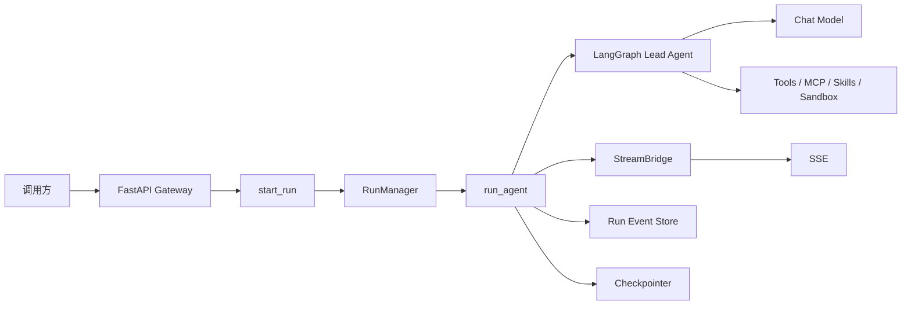

# intelli-engine 后端 AI 能力平台设计报告

> 文档版本：v0.2  
> 日期：2026-06-23  
> 状态：设计讨论稿  
> 范围：后端能力平台设计，不包含 intelli-engine 自带前端改造  
> 说明：本文件是 v0.2 新版本设计文档，不修改 `docs/intelli-engine-agent-backend-platform-design.md` v0.1。

## 1. 版本变更记录

### v0.2

在 v0.1 基础上新增和调整：

- 明确外部前端团队会传入：
  - 对话框输入内容。
  - 用户选择的数据源。
- 基于当前代码实现，说明原对话接口是什么，新对外接口是什么，做了哪些改动。
- 新增 `datasource_ids` / `data_sources` 作为对话入参扩展。
- 明确不建议前端将数据源正文直接拼进用户问题。
- 新增会话列表、会话详情、会话更新、会话删除、聊天记录、会话 Run 列表等接口封装。
- 将 `thread` 内部概念统一包装为外部 `conversation` 概念。
- 将数据源、问答、报告生成 PDF/DOCX、AI Logo 图片生成纳入统一能力平台设计。

### v0.1

初版设计内容：

- intelli-engine 后端 AI 能力平台定位。
- 当前代码模块结构与运行链路。
- `/api/v1` 外部接口层。
- Conversation / Agent / Run / Artifact / Capabilities API。
- Swagger/OpenAPI 在线接口文档要求。
- AI Logo 语义理解到图片生成。
- 数据源 + 问答总结 + PDF/DOCX 报告生成。
- 阶段计划与验收标准。

## 2. 背景与目标

`intelli-engine` 当前是基于 DeerFlow/OntoAgent 的全栈项目，后端具备 Agent Runtime、对话、工具、技能、MCP、沙箱、文件上传、记忆、产物等能力。

后续项目定位调整为：

```text
intelli-engine 不使用自身前端作为主要交付形态。
另一个团队负责前端。
intelli-engine 只提供后端对话、Agent、数据源、Logo、报告等 AI 能力。
```

因此，本设计目标是：

```text
将 intelli-engine 后端包装成可被其它应用稳定集成调用的 Agent Backend / AI Capability Service。
```

外部前端团队主要需要：

- 会话列表。
- 会话详情。
- 会话聊天记录。
- 创建会话。
- 发送非流式消息。
- 发送流式消息。
- 选择数据源后进行问答。
- 调用指定 Agent。
- 生成 Logo/图片。
- 基于数据源和问答过程生成 PDF/DOCX 报告。
- 访问生成产物。

## 3. 当前代码事实

### 3.1 当前后端分层

当前后端主要分为两层。

#### App 应用层

路径：

```text
backend/app
```

职责：

- FastAPI Gateway。
- HTTP API。
- 鉴权。
- 路由。
- IM 渠道。

关键文件：

```text
backend/app/gateway/app.py
backend/app/gateway/deps.py
backend/app/gateway/services.py
backend/app/gateway/routers/threads.py
backend/app/gateway/routers/thread_runs.py
backend/app/gateway/routers/runs.py
backend/app/gateway/routers/agents.py
backend/app/gateway/routers/artifacts.py
backend/app/gateway/routers/uploads.py
```

#### Harness 智能体框架层

路径：

```text
backend/packages/harness/deerflow
```

职责：

- LangGraph Agent Runtime。
- Lead Agent。
- Middleware 链。
- Tools。
- Skills。
- MCP。
- Sandbox。
- Models。
- Memory。
- Persistence。
- RunManager。
- StreamBridge。

关键文件：

```text
backend/packages/harness/deerflow/agents/lead_agent/agent.py
backend/packages/harness/deerflow/tools/tools.py
backend/packages/harness/deerflow/runtime/runs/worker.py
backend/packages/harness/deerflow/models/factory.py
```

### 3.2 当前运行链路



关键事实：

- LangGraph 入口在 `backend/langgraph.json`。
- 图注册为 `deerflow.agents:make_lead_agent`。
- Gateway 通过 `start_run()` 创建后台任务。
- `run_agent()` 执行 Agent。
- `StreamBridge` 负责流式输出。
- `RunEventStore` 记录消息与事件。
- `Checkpointer` 维护多轮上下文。

### 3.3 Harness / App 依赖边界

当前代码有明确边界：

```text
app -> deerflow    允许
deerflow -> app    禁止
```

该边界由测试约束：

```text
backend/tests/test_harness_boundary.py
```

因此新建的 `/api/v1` 外部接口适配层应放在：

```text
backend/app/gateway
```

不应放入：

```text
backend/packages/harness/deerflow
```

## 4. 当前原接口是什么

### 4.1 当前底层对话执行接口

当前真实对话执行接口在：

```text
backend/app/gateway/routers/thread_runs.py
backend/app/gateway/routers/runs.py
```

典型接口：

```http
POST /api/threads/{thread_id}/runs/wait
POST /api/threads/{thread_id}/runs/stream
POST /api/runs/wait
POST /api/runs/stream
```

当前请求体核心结构是 `RunCreateRequest`：

```json
{
  "assistant_id": "lead_agent",
  "input": {
    "messages": [
      {
        "role": "user",
        "content": "请分析这些材料的主要风险"
      }
    ]
  },
  "metadata": {
    "project_id": "p_001"
  },
  "context": {
    "model_name": "default",
    "thinking_enabled": true,
    "subagent_enabled": false
  },
  "stream_mode": ["values", "messages"]
}
```

这个接口适合内部或 LangGraph 兼容场景，但对外部前端团队有几个问题：

- 使用 `thread_id`，不符合业务前端常用的 `conversation_id` 语义。
- 使用 `assistant_id`，不如 `agent_id` 直观。
- 使用 `input.messages`，结构偏底层。
- 使用 `context` / `configurable` / `stream_mode`，前端不应理解这些内部概念。
- 当前没有“本轮选择哪些数据源”的标准字段。

### 4.2 当前底层会话接口

当前会话相关接口主要在：

```text
backend/app/gateway/routers/threads.py
backend/app/gateway/routers/thread_runs.py
```

已有接口：

```http
POST /api/threads
POST /api/threads/search
GET  /api/threads/{thread_id}
PATCH /api/threads/{thread_id}
DELETE /api/threads/{thread_id}
GET  /api/threads/{thread_id}/state
POST /api/threads/{thread_id}/history
GET  /api/threads/{thread_id}/messages
GET  /api/threads/{thread_id}/runs
GET  /api/threads/{thread_id}/runs/{run_id}/messages
```

这些接口已有底层能力，但存在对外封装问题：

- 名称是 `thread`，外部业务更适合叫 `conversation`。
- 返回中可能包含 checkpoint、state、channel values、interrupts 等内部概念。
- 消息格式偏 run event 内部结构。
- 缺少适合前端会话列表展示的简洁字段，例如：
  - 标题。
  - 最后一条消息。
  - agent_id。
  - 业务 metadata。
  - 分页信息。
  - 当前运行状态。

### 4.3 当前上传和数据源相关能力

当前已有文件上传接口：

```http
POST /api/threads/{thread_id}/uploads
```

上传后的文件会通过 `UploadsMiddleware` 注入 Agent 上下文。

但当前缺少：

```text
本轮对话选择了哪些数据源
```

的标准字段。

如果前端想让用户“选择若干数据源再提问”，当前只能采用不推荐的方式：

- 将数据源全文直接拼到 `content`。
- 将数据源 ID 放到 `metadata`。
- 将数据源信息塞到 `input.messages.additional_kwargs`。

这些方式都不稳定，也不利于后续报告生成、引用追踪和上下文裁剪。

## 5. 新对外接口是什么

### 5.1 新增 `/api/v1` 外部适配层

建议新增：

```text
/api/v1/*
```

保留原有：

```text
/api/*
```

设计原则：

```text
原 /api 接口继续作为内部兼容接口。
新 /api/v1 接口作为外部团队稳定调用契约。
```

### 5.2 外部核心概念

外部团队只应理解以下概念：

```text
conversation_id
agent_id
run_id
datasource_id
artifact_id
report_id
job_id
```

不应要求外部团队理解：

```text
thread_id
checkpoint
RunnableConfig
configurable
stream_mode
LangGraph values/messages/custom
sandbox virtual path
/mnt/user-data/outputs
SOUL.md
```

### 5.3 新接口总览

#### Conversation

```http
GET    /api/v1/conversations
POST   /api/v1/conversations
GET    /api/v1/conversations/{conversation_id}
PATCH  /api/v1/conversations/{conversation_id}
DELETE /api/v1/conversations/{conversation_id}

GET    /api/v1/conversations/{conversation_id}/messages
POST   /api/v1/conversations/{conversation_id}/messages
POST   /api/v1/conversations/{conversation_id}/stream

GET    /api/v1/conversations/{conversation_id}/runs
```

#### Agent

```http
GET  /api/v1/agents
POST /api/v1/agents/{agent_id}/invoke
POST /api/v1/agents/{agent_id}/stream
```

#### Run

```http
GET  /api/v1/runs/{run_id}
POST /api/v1/runs/{run_id}/cancel
```

#### DataSource

```http
POST /api/v1/conversations/{conversation_id}/data-sources
GET  /api/v1/conversations/{conversation_id}/data-sources
```

#### Report

```http
POST /api/v1/conversations/{conversation_id}/reports
GET  /api/v1/reports/{report_id}
```

#### Artifact

```http
GET /api/v1/artifacts/{artifact_id}
GET /api/v1/conversations/{conversation_id}/artifacts
```

#### AI Logo

```http
POST /api/v1/ai/logo/generate
GET  /api/v1/ai/logo/jobs/{job_id}
```

#### Capabilities

```http
GET /api/v1/capabilities
```

## 6. 对话入参如何调整

### 6.1 原内部接口入参

原内部接口：

```http
POST /api/threads/{thread_id}/runs/wait
```

原请求体：

```json
{
  "assistant_id": "lead_agent",
  "input": {
    "messages": [
      {
        "role": "user",
        "content": "请基于材料总结风险"
      }
    ]
  },
  "metadata": {
    "project_id": "p_001"
  },
  "context": {
    "model_name": "default",
    "thinking_enabled": true,
    "subagent_enabled": false
  }
}
```

### 6.2 新外部接口入参

新外部接口：

```http
POST /api/v1/conversations/{conversation_id}/messages
POST /api/v1/conversations/{conversation_id}/stream
```

建议请求体：

```json
{
  "agent_id": "lead-agent",
  "content": "请基于选中的数据源，总结主要风险和建议。",
  "datasource_ids": ["ds_001", "ds_002"],
  "options": {
    "model": "default",
    "thinking_enabled": true,
    "subagent_enabled": false,
    "citation_required": true,
    "max_context_tokens": 8000
  },
  "metadata": {
    "project_id": "p_001",
    "biz_scene": "risk_analysis"
  }
}
```

### 6.3 做了哪些改动

| 原字段 | 新字段 | 改动说明 |
|---|---|---|
| `thread_id` | `conversation_id` | 对外使用业务会话语义 |
| `assistant_id` | `agent_id` | 对外使用 Agent 语义 |
| `input.messages[0].content` | `content` | 简化前端入参 |
| `context` | `options` | 只暴露业务可理解的运行选项 |
| 无 | `datasource_ids` | 新增本轮对话选择的数据源 |
| `metadata` | `metadata` | 保留，用于业务追踪 |
| `stream_mode` | 不暴露 | v1 层内部决定 |

### 6.4 新接口内部如何转换为当前实现

v1 adapter 将外部请求转换为当前 `RunCreateRequest`：

```json
{
  "assistant_id": "lead-agent",
  "input": {
    "messages": [
      {
        "role": "user",
        "content": "请基于选中的数据源，总结主要风险和建议。"
      }
    ]
  },
  "metadata": {
    "project_id": "p_001",
    "biz_scene": "risk_analysis",
    "datasource_ids": ["ds_001", "ds_002"]
  },
  "context": {
    "model_name": "default",
    "thinking_enabled": true,
    "subagent_enabled": false
  },
  "stream_mode": ["values", "messages"]
}
```

然后继续复用：

```text
start_run()
wait_for_run_completion()
StreamBridge
RunEventStore
Checkpointer
```

## 7. 数据源如何随对话一起传递

### 7.1 不推荐：前端拼接数据源正文

不建议前端这样传：

```json
{
  "content": "用户问题：...\n\n数据源1：...\n\n数据源2：..."
}
```

原因：

- 前端要承担拼接规则，容易不一致。
- 数据源过大容易爆上下文。
- 无法做引用追踪。
- 无法复用数据源缓存和摘要。
- 无法做分块检索和上下文裁剪。
- 后续生成报告时难以知道结论来自哪个数据源。

### 7.2 推荐：前端只传数据源 ID

推荐前端传：

```json
{
  "content": "请基于选中的数据源分析风险。",
  "datasource_ids": ["ds_001", "ds_002"]
}
```

后端负责：

```text
datasource_ids
  -> 查询数据源元信息
  -> 读取/解析/摘要/检索相关片段
  -> 控制注入 token 大小
  -> 构造 Agent 上下文
  -> 调用现有 Run 流程
```

### 7.3 扩展版本：data_sources 对象数组

第一期可用 `datasource_ids`。

后续如果需要更精细控制，可扩展为：

```json
{
  "content": "请基于选中的数据源分析风险。",
  "data_sources": [
    {
      "datasource_id": "ds_001",
      "scope": "full"
    },
    {
      "datasource_id": "ds_002",
      "scope": "summary"
    }
  ]
}
```

可选字段：

| 字段 | 说明 |
|---|---|
| `datasource_id` | 数据源 ID |
| `scope` | `full` / `summary` / `relevant_chunks` |
| `filters` | 页码、章节、字段等过滤条件 |
| `top_k` | 检索片段数量 |
| `max_tokens` | 单数据源上下文预算 |

### 7.4 后端注入 Agent 的推荐格式

不建议污染用户原始问题。推荐后端构造受控上下文，例如：

```text
HumanMessage:
  content = 用户原始问题

System / Context:
  <selected_data_sources>
    <source id="ds_001" name="项目尽调材料.pdf" type="pdf">
      <summary>...</summary>
      <relevant_chunks>
        <chunk id="ds_001#p3">...</chunk>
      </relevant_chunks>
    </source>
  </selected_data_sources>
```

这样 Agent 能区分：

- 用户真正问了什么。
- 后端提供了哪些数据源上下文。
- 哪些结论应引用哪些数据源。

### 7.5 和报告生成的关系

`datasource_ids` 不只是对话上下文输入，也应记录到：

```text
run metadata
conversation metadata
report source list
```

这样后续生成 PDF/DOCX 报告时，可以知道：

- 报告基于哪些数据源。
- 哪些问答轮次引用了哪些数据源。
- 报告结论应如何标注来源。

## 8. 会话列表与聊天记录接口封装

### 8.1 为什么需要封装

外部前端团队需要常规聊天产品能力：

- 会话列表。
- 会话详情。
- 修改会话标题。
- 删除会话。
- 聊天记录。
- 会话运行状态。
- 会话下的 Run 列表。

当前底层已有 `threads` 和 `thread_runs` 能力，但需要转换为前端可用的 `conversations` API。

### 8.2 会话列表

```http
GET /api/v1/conversations
```

查询参数：

```text
limit=20
offset=0
status=idle|running|error|interrupted
agent_id=brand-agent
project_id=p_001
```

响应：

```json
{
  "items": [
    {
      "conversation_id": "conv_001",
      "title": "咖啡品牌 Logo 设计",
      "agent_id": "brand-agent",
      "status": "idle",
      "last_message": {
        "role": "assistant",
        "content": "已为你总结出三个品牌方向..."
      },
      "created_at": "2026-06-23T10:00:00Z",
      "updated_at": "2026-06-23T10:10:00Z",
      "metadata": {
        "project_id": "p_001"
      }
    }
  ],
  "pagination": {
    "limit": 20,
    "offset": 0,
    "has_more": false
  }
}
```

内部映射：

```text
ThreadMetaStore.search()
run_event_store.list_messages(thread_id, limit=1)
```

或等价复用：

```text
POST /api/threads/search
GET /api/threads/{thread_id}/messages
```

### 8.3 会话详情

```http
GET /api/v1/conversations/{conversation_id}
```

响应：

```json
{
  "conversation_id": "conv_001",
  "title": "咖啡品牌 Logo 设计",
  "agent_id": "brand-agent",
  "status": "idle",
  "created_at": "...",
  "updated_at": "...",
  "metadata": {
    "project_id": "p_001"
  }
}
```

内部映射：

```text
GET /api/threads/{thread_id}
```

v1 层过滤掉：

```text
values
interrupts
checkpoint
channel_values
```

### 8.4 修改会话

```http
PATCH /api/v1/conversations/{conversation_id}
```

请求：

```json
{
  "title": "新的会话标题",
  "metadata": {
    "project_id": "p_001",
    "biz_scene": "report_generation"
  }
}
```

内部映射：

```text
PATCH /api/threads/{thread_id}
POST /api/threads/{thread_id}/state
ThreadMetaStore.update_display_name()
```

说明：

- `metadata` 可映射到 thread metadata。
- `title` 应同步到 thread display name 或 state title。

### 8.5 删除会话

```http
DELETE /api/v1/conversations/{conversation_id}
```

内部映射：

```text
DELETE /api/threads/{thread_id}
```

应清理：

- thread metadata。
- checkpoint。
- thread local files。
- uploads。
- outputs。

### 8.6 聊天记录

```http
GET /api/v1/conversations/{conversation_id}/messages
```

查询参数：

```text
limit=50
before_seq=123
after_seq=100
```

响应：

```json
{
  "conversation_id": "conv_001",
  "items": [
    {
      "message_id": "msg_001",
      "run_id": "run_001",
      "role": "user",
      "content": "请基于材料总结风险",
      "created_at": "2026-06-23T10:00:00Z",
      "metadata": {}
    },
    {
      "message_id": "msg_002",
      "run_id": "run_001",
      "role": "assistant",
      "content": "主要风险包括...",
      "created_at": "2026-06-23T10:01:00Z",
      "metadata": {
        "feedback": null
      }
    }
  ],
  "pagination": {
    "limit": 50,
    "has_more": false
  }
}
```

内部映射：

```text
GET /api/threads/{thread_id}/messages
run_event_store.list_messages(thread_id)
```

v1 层角色转换：

| 内部事件 | 外部 role |
|---|---|
| `human_message` | `user` |
| `ai_message` | `assistant` |
| `tool_message` | `tool` |
| `system_message` | `system` |

### 8.7 会话 Run 列表

```http
GET /api/v1/conversations/{conversation_id}/runs
```

响应：

```json
{
  "conversation_id": "conv_001",
  "items": [
    {
      "run_id": "run_001",
      "agent_id": "brand-agent",
      "status": "success",
      "created_at": "...",
      "updated_at": "...",
      "usage": {
        "total_tokens": 600
      }
    }
  ]
}
```

内部映射：

```text
GET /api/threads/{thread_id}/runs
RunManager.list_by_thread()
```

## 9. Agent API

### 9.1 查询 Agent

```http
GET /api/v1/agents
```

第一阶段只读，不开放创建/修改。

推荐预置：

```text
lead-agent
brand-agent
copywriting-agent
logo-agent
report-agent
```

响应：

```json
{
  "agents": [
    {
      "agent_id": "lead-agent",
      "name": "通用智能体",
      "type": "system",
      "description": "通用任务和对话",
      "enabled": true
    },
    {
      "agent_id": "report-agent",
      "name": "报告智能体",
      "type": "custom",
      "description": "基于数据源和问答过程生成 PDF/DOCX 报告",
      "enabled": true
    }
  ]
}
```

内部映射：

```text
系统 Agent: lead-agent
自定义 Agent: deerflow.config.agents_config.list_custom_agents()
```

### 9.2 一次性调用 Agent

```http
POST /api/v1/agents/{agent_id}/invoke
```

内部流程：

```text
生成临时 conversation/thread
assistant_id = agent_id
start_run()
wait_for_run_completion()
返回最终 assistant message
```

### 9.3 流式调用 Agent

```http
POST /api/v1/agents/{agent_id}/stream
```

内部流程：

```text
生成临时 conversation/thread
assistant_id = agent_id
start_run()
StreamBridge.subscribe()
SSE normalize
```

## 10. SSE 协议

第一阶段外部只暴露：

```text
run.started
message.delta
run.completed
run.failed
```

示例：

```text
event: run.started
data: {"run_id":"run_001","conversation_id":"conv_001","agent_id":"brand-agent"}

event: message.delta
data: {"run_id":"run_001","delta":"你好"}

event: run.completed
data: {"run_id":"run_001","status":"success"}

event: run.failed
data: {"run_id":"run_001","error":{"code":"RUN_FAILED","message":"..."}}
```

内部映射：

| 内部事件 | 外部事件 |
|---|---|
| `metadata` | `run.started` |
| `messages` | `message.delta` |
| `error` | `run.failed` |
| `end` | `run.completed` |

不应将 LangGraph 原始 `values/messages/custom` 直接暴露给前端团队。

## 11. DataSource API

### 11.1 数据源类型

第一期支持：

| 类型 | 说明 |
|---|---|
| 文件上传 | PDF / DOCX / XLSX / CSV / TXT / Markdown |
| 文本输入 | 用户直接粘贴文本 |
| URL | 网页内容抓取 |
| 对话上下文 | conversation messages / run events |
| 结构化数据 | JSON 表单、业务对象 |

### 11.2 登记数据源

```http
POST /api/v1/conversations/{conversation_id}/data-sources
```

请求：

```json
{
  "type": "text",
  "name": "项目背景资料",
  "content": "这里是用户输入的数据源内容...",
  "metadata": {
    "source_type": "manual",
    "biz_id": "p_001"
  }
}
```

响应：

```json
{
  "datasource_id": "ds_001",
  "conversation_id": "conv_001",
  "type": "text",
  "name": "项目背景资料",
  "status": "ready"
}
```

### 11.3 查询数据源

```http
GET /api/v1/conversations/{conversation_id}/data-sources
```

## 12. Report Generation API

### 12.1 能力定义

支持：

```text
根据用户输入的数据源及问答过程，最终总结生成报告，并导出 PDF/DOCX。
```

这不是简单聊天记录导出，而是：

```text
DataSource + Conversation QA -> report-agent -> ReportSpec -> DOCX/PDF -> Artifact
```

### 12.2 生成报告

```http
POST /api/v1/conversations/{conversation_id}/reports
```

请求：

```json
{
  "title": "项目分析报告",
  "format": ["pdf", "docx"],
  "report_type": "analysis",
  "datasource_ids": ["ds_001", "ds_002"],
  "include_conversation": true,
  "include_citations": true,
  "language": "zh-CN",
  "style": "business",
  "sections": [
    "执行摘要",
    "背景与数据来源",
    "关键发现",
    "问答洞察总结",
    "风险与建议",
    "附录"
  ]
}
```

响应：

```json
{
  "report_id": "rep_001",
  "run_id": "run_001",
  "conversation_id": "conv_001",
  "status": "queued"
}
```

### 12.3 查询报告

```http
GET /api/v1/reports/{report_id}
```

成功响应：

```json
{
  "report_id": "rep_001",
  "status": "success",
  "title": "项目分析报告",
  "artifacts": [
    {
      "artifact_id": "art_docx_001",
      "format": "docx",
      "filename": "project-analysis-report.docx",
      "url": "/api/v1/artifacts/art_docx_001"
    },
    {
      "artifact_id": "art_pdf_001",
      "format": "pdf",
      "filename": "project-analysis-report.pdf",
      "url": "/api/v1/artifacts/art_pdf_001"
    }
  ],
  "summary": "报告已基于 2 个数据源和 14 轮问答生成。"
}
```

### 12.4 ReportSpec 中间格式

Agent 不应直接生成 DOCX/PDF，而应先生成结构化 `ReportSpec`：

```json
{
  "title": "项目分析报告",
  "subtitle": "基于用户数据源与问答过程生成",
  "metadata": {
    "author": "intelli-engine",
    "language": "zh-CN"
  },
  "sections": [
    {
      "heading": "执行摘要",
      "content": [
        {
          "type": "paragraph",
          "text": "..."
        },
        {
          "type": "bullets",
          "items": ["...", "..."]
        }
      ]
    }
  ],
  "citations": [
    {
      "id": "src_001",
      "label": "项目背景资料",
      "source_type": "datasource",
      "locator": "第 2 段"
    }
  ]
}
```

优点：

- 内容和渲染解耦。
- 同源生成 DOCX/PDF。
- 易于测试。
- 易于模板化。
- 易于引用校验。

## 13. AI Logo 图片生成能力

### 13.1 能力定义

`ai-logo` 要支持：

```text
基于用户自然语言语义理解，进行 Logo 或图片设计，并最终生成 Logo 图片。
```

完整链路：

```text
自然语言需求
  -> 语义理解
  -> 品牌 Brief
  -> 视觉方向
  -> 图像 Prompt
  -> 图像生成模型
  -> 保存图片
  -> 返回 artifact
```

### 13.2 接口

```http
POST /api/v1/ai/logo/generate
GET  /api/v1/ai/logo/jobs/{job_id}
```

请求：

```json
{
  "input": "我想做一个面向年轻白领的精品咖啡品牌 logo，名字叫 Mellow Cup，希望简洁、有温度、不要太复杂",
  "options": {
    "style": "minimal",
    "count": 4,
    "size": "1024x1024",
    "transparent_background": true,
    "language": "zh-CN"
  },
  "metadata": {
    "project_id": "p_001"
  }
}
```

响应：

```json
{
  "job_id": "job_logo_001",
  "run_id": "run_001",
  "status": "queued",
  "conversation_id": "conv_001"
}
```

查询结果：

```json
{
  "job_id": "job_logo_001",
  "status": "success",
  "design": {
    "brand_understanding": "...",
    "visual_direction": "...",
    "prompt": "...",
    "negative_prompt": "..."
  },
  "assets": [
    {
      "artifact_id": "art_001",
      "url": "/api/v1/artifacts/art_001",
      "mime_type": "image/png",
      "width": 1024,
      "height": 1024
    }
  ]
}
```

## 14. Artifact API

### 14.1 目标

对外不暴露：

```text
/mnt/user-data/outputs
thread virtual path
```

对外只暴露：

```text
artifact_id
url
filename
mime_type
```

### 14.2 接口

```http
GET /api/v1/artifacts/{artifact_id}
GET /api/v1/conversations/{conversation_id}/artifacts
```

DTO：

```json
{
  "artifact_id": "art_001",
  "conversation_id": "conv_001",
  "run_id": "run_001",
  "filename": "report.pdf",
  "mime_type": "application/pdf",
  "url": "/api/v1/artifacts/art_001",
  "created_at": "2026-06-23T10:00:00Z"
}
```

## 15. 在线接口文档

### 15.1 推荐方式

当前后端是 FastAPI，建议直接使用 FastAPI 原生 OpenAPI + Swagger UI。

提供：

```text
/docs
/redoc
/openapi.json
```

如需外部 API 专属文档，可扩展：

```text
/api/v1/docs
/api/v1/openapi.json
```

### 15.2 OpenAPI Tags

建议：

```text
v1-conversations
v1-agents
v1-runs
v1-data-sources
v1-reports
v1-artifacts
v1-ai-logo
v1-capabilities
```

### 15.3 文档要求

每个接口必须提供：

- `summary`。
- `description`。
- `response_model`。
- 请求示例。
- 响应示例。
- 错误响应。
- SSE 事件说明。

### 15.4 文档验收

实现时必须满足：

```text
1. 启动 Gateway 后能访问 /docs。
2. /docs 中能看到所有 /api/v1 接口。
3. 每个接口有清晰 summary/description/schema。
4. /openapi.json 可导入 Apifox/Postman。
5. SSE 协议有文档说明。
6. 生产环境可通过 GATEWAY_ENABLE_DOCS 控制是否暴露文档。
```

## 16. 错误码规范

统一错误结构：

```json
{
  "success": false,
  "error": {
    "code": "AGENT_NOT_FOUND",
    "message": "Agent not found",
    "details": {}
  },
  "request_id": "req_001"
}
```

建议错误码：

```text
UNAUTHORIZED
FORBIDDEN
INVALID_ARGUMENT
APP_NOT_ALLOWED
CONVERSATION_NOT_FOUND
AGENT_NOT_FOUND
MODEL_NOT_AVAILABLE
RUN_CONFLICT
RUN_NOT_FOUND
RUN_CANCELLED
RUN_FAILED
ARTIFACT_NOT_FOUND
DATASOURCE_NOT_FOUND
REPORT_NOT_FOUND
FILE_TOO_LARGE
RATE_LIMITED
MODEL_TIMEOUT
MODEL_PROVIDER_ERROR
TOOL_EXECUTION_ERROR
INTERNAL_ERROR
SERVICE_UNAVAILABLE
```

## 17. 推荐新增文件结构

```text
backend/app/gateway/routers/v1/
  __init__.py
  conversations.py
  agents.py
  runs.py
  capabilities.py
  data_sources.py
  reports.py
  artifacts.py
  ai_logo.py

backend/app/gateway/schemas/v1/
  __init__.py
  common.py
  conversations.py
  agents.py
  runs.py
  capabilities.py
  data_sources.py
  reports.py
  artifacts.py
  ai_logo.py

backend/app/gateway/services/v1/
  __init__.py
  external_context.py
  run_adapter.py
  sse_mapper.py
  conversation_service.py
  agent_service.py
  run_service.py
  data_source_service.py
  report_service.py
  artifact_service.py
  logo_service.py
```

## 18. 分阶段实施路线

### 18.1 第一阶段：Agent Backend Adapter + 会话封装

范围：

```http
GET    /api/v1/conversations
POST   /api/v1/conversations
GET    /api/v1/conversations/{id}
PATCH  /api/v1/conversations/{id}
DELETE /api/v1/conversations/{id}
GET    /api/v1/conversations/{id}/messages
POST   /api/v1/conversations/{id}/messages
POST   /api/v1/conversations/{id}/stream
GET    /api/v1/conversations/{id}/runs

GET  /api/v1/agents
POST /api/v1/agents/{id}/invoke
POST /api/v1/agents/{id}/stream

GET  /api/v1/runs/{id}
POST /api/v1/runs/{id}/cancel
GET  /api/v1/capabilities
```

重点：

- 封装会话列表。
- 封装聊天记录。
- 新增 `datasource_ids` 入参。
- 标准化 SSE。
- 提供 Swagger/OpenAPI。

### 18.2 第二阶段：DataSource + Report Generation

范围：

```http
POST /api/v1/conversations/{id}/data-sources
GET  /api/v1/conversations/{id}/data-sources
POST /api/v1/conversations/{id}/reports
GET  /api/v1/reports/{report_id}
GET  /api/v1/artifacts/{artifact_id}
```

目标：

```text
DataSource + Conversation QA -> report-agent -> ReportSpec -> DOCX/PDF -> Artifact
```

### 18.3 第三阶段：AI Logo 图片生成

范围：

```http
POST /api/v1/ai/logo/generate
GET  /api/v1/ai/logo/jobs/{job_id}
```

目标：

```text
Natural Language -> logo-agent -> Visual Brief -> Image Prompt -> Image Model -> Logo Artifact
```

### 18.4 第四阶段：平台治理

范围：

- API Key 管理。
- 应用限流。
- Token 配额。
- 审计日志。
- 调用统计。
- Artifact Registry 持久化。
- Report 模板管理。
- Logo 供应商切换。
- SDK 生成。

## 19. 第一阶段验收标准

第一阶段完成后，前端团队应能：

```text
1. 通过 API Key 调用 intelli-engine。
2. 查询会话列表。
3. 创建会话。
4. 查看会话详情。
5. 查看聊天记录。
6. 发送非流式消息。
7. 发送流式消息并接收 message.delta。
8. 对话时传入 datasource_ids。
9. 查询可用 Agent。
10. 调用指定 Agent。
11. 查询 Run 状态。
12. 取消 Run。
13. 打开 Swagger 文档查看 /api/v1 接口。
14. 导出 /openapi.json 导入 Apifox/Postman。
```

前端团队不需要理解：

```text
thread_id
checkpoint
RunnableConfig
stream_mode
LangGraph event
sandbox path
SOUL.md
```

## 20. 测试建议

建议新增：

```text
backend/tests/test_v1_external_context.py
backend/tests/test_v1_run_adapter.py
backend/tests/test_v1_conversations.py
backend/tests/test_v1_conversation_messages.py
backend/tests/test_v1_conversation_runs.py
backend/tests/test_v1_agents.py
backend/tests/test_v1_runs.py
backend/tests/test_v1_sse_mapper.py
backend/tests/test_v1_data_sources.py
backend/tests/test_v1_reports.py
backend/tests/test_v1_artifacts.py
backend/tests/test_v1_ai_logo.py
backend/tests/test_v1_openapi.py
```

重点验证：

- `conversation_id` 是否正确映射 `thread_id`。
- 会话列表是否过滤内部字段。
- 聊天记录格式是否适合前端。
- `datasource_ids` 是否进入 run metadata。
- `datasource_ids` 是否触发数据源上下文注入。
- `agent_id` 是否正确映射 `assistant_id/agent_name`。
- SSE 是否只输出 v1 标准事件。
- OpenAPI 是否包含 v1 接口。
- ReportSpec 是否可稳定生成。
- DOCX/PDF artifact 是否可访问。
- Logo job 是否可查询。

## 21. 结论

基于当前实现，最合理的方案不是修改底层 LangGraph/DeerFlow 接口，而是新增 `/api/v1` 外部适配层。

核心改动是：

```text
原内部 RunCreateRequest
  -> 保留

新外部 ConversationMessageRequest
  -> 新增 content + datasource_ids + options
  -> v1 adapter 转换为 RunCreateRequest
```

同时，前端团队需要的会话能力应完整封装：

```text
会话列表
会话详情
会话更新
会话删除
聊天记录
会话 Run 列表
```

数据源不应由前端拼接正文，而应通过：

```text
datasource_ids
```

传给 intelli-engine，由后端负责数据源解析、摘要、检索、裁剪和上下文注入。

最终平台能力演进为：

```text
Conversation + Agent + DataSource + Report + Logo + Artifact
```

从而让 intelli-engine 成为可被多个业务系统集成的后端 AI 能力平台。
