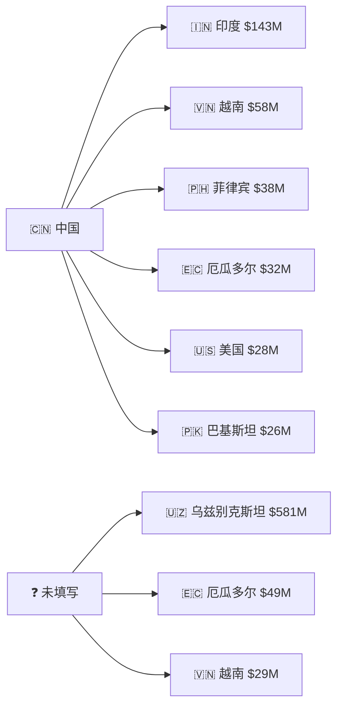

# 海关交易数据统计分析报告

> **数据来源**：本地测试 MySQL 数据库 `trade_records` 表  
> **数据规模**：25,346 条交易记录  
> **时间范围**：2023年6月 — 2026年6月  
> **报告生成日期**：2026年6月24日

---

## 目录

1. [核心摘要](#1-核心摘要)
2. [年度贸易总览](#2-年度贸易总览)
3. [月度与季度趋势分析](#3-月度与季度趋势分析)
4. [贸易伙伴分析（按国家/地区）](#4-贸易伙伴分析按国家地区)
5. [商品结构与 HS 编码分析](#5-商品结构与-hs-编码分析)
6. [贸易路线分析（起运国 → 目的国）](#6-贸易路线分析起运国--目的国)
7. [量与价统计分析](#7-量与价统计分析)
8. [2026年前瞻](#8-2026年前瞻)
9. [附录：数据说明](#9-附录数据说明)

---

## 1. 核心摘要

| 指标 | 数值 |
|------|------|
| **交易记录总数** | 25,346 条 |
| **总交易金额** | **$1,053,329,083.23** |
| **总数量** | 54,317,892 件/单位 |
| **总重量** | 65,520,132.61 kg |
| **平均单价** | $13,237.18 |
| **覆盖国家/地区** | 供应商 7 个，采购商 38 个 |
| **主要商品类别** | 水泥厂设备、PU 合成革、电缆、机械配件 |

**关键发现：**

- **贸易高峰年**为 2023年（$5.81亿），主要受大型水泥厂成套设备出口驱动
- **主要供应商**为中国，占可识别供应商交易额的 **97%** 以上
- **主要采购市场**为 **印度**（$1.44亿）、**厄瓜多尔**（$6,325万）、**越南**（$6,084万）、**乌兹别克斯坦**（$5,768万）
- **核心商品**：纺织涂层布/人造革（HS 5903）以 **$1.87亿** 居首，水泥/矿山设备类机械（HS 8474、8421、8428 等）合计超 **$3.5亿**

---

## 2. 年度贸易总览

### 2.1 年度核心指标

| 年份 | 交易总额 | 记录数 | 平均单价 | 总数量 | 总重量(kg) |
|------|---------|--------|---------|--------|-----------|
| **2023** (6-12月) | **$581,416,549.00** | 6,486 | $42,217.74 | 11,238,386 | 34,099,086 |
| **2024** | **$364,763,189.80** | 11,497 | $4,984.42 | 26,551,522 | 17,405,851 |
| **2025** | **$102,704,866.00** | 6,966 | $612.11 | 15,560,413 | 13,590,889 |
| **2026** (1-3月) | **$4,438,478.43** | 397 | $290.87 | 967,571 | 424,306 |

### 2.2 年度趋势分析

```mermaid
%%{init: {'theme': 'neutral', 'themeVariables': { 'primaryColor': '#2B6CB0'}}}%%
bar
    title 年度交易总额趋势（美元）
    "2023(6-12月)" : 581416549
    "2024" : 364763190
    "2025" : 102704866
    "2026(1-3月)" : 4438478
```

**趋势解读：**

- **2023年** 虽然只有7个月数据，但交易额最高，达 **$5.81亿**。这主要归因于当年有多笔大型水泥厂成套设备出口（如袋式过滤器 $2,299万、蒸汽轮机 $1,765万、立式煤磨机 $1,171万等），单笔交易金额大、单价高（平均 $42,217）。
- **2024年** 交易额回落至 **$3.64亿**，但交易记录数最多（11,497条），说明交易更加碎片化、高频次，平均单价降至 $4,984。
- **2025年** 继续下降至 **$1.02亿**，平均单价进一步降至 $612，反映出交易结构从大型设备转向中小型商品。
- **2026年** 仅前3个月数据，交易额 $443万，尚在爬坡阶段。

---

## 3. 月度与季度趋势分析

### 3.1 月度交易趋势（2024-2025）

| 月份 | 2024年 | 2025年 | 同比变化 |
|------|--------|--------|---------|
| 1月 | $49,437,704 | $10,132,309 | -79.5% |
| 2月 | $49,543,741 | $7,494,474 | -84.9% |
| 3月 | $27,219,739 | $12,932,299 | -52.5% |
| 4月 | $15,947,197 | $11,468,284 | -28.1% |
| 5月 | $29,295,701 | $6,805,410 | -76.8% |
| 6月 | $25,604,367 | $9,017,001 | -64.8% |
| 7月 | $21,912,916 | $6,955,858 | -68.3% |
| 8月 | $32,277,774 | $18,876,649 | -41.5% |
| 9月 | $28,493,796 | $4,970,698 | -82.6% |
| 10月 | $21,972,053 | $2,444,876 | -88.9% |
| 11月 | $28,522,364 | $8,824,254 | -69.1% |
| 12月 | $34,535,838 | $2,782,754 | -91.9% |

```mermaid
%%{init: {'theme': 'neutral', 'themeVariables': { 'primaryColor': '#2B6CB0'}}}%%
line
    title 月度交易趋势对比（2024 vs 2025）
    x-axis ["1月","2月","3月","4月","5月","6月","7月","8月","9月","10月","11月","12月"]
    "2024" : 49.4, 49.5, 27.2, 15.9, 29.3, 25.6, 21.9, 32.3, 28.5, 22.0, 28.5, 34.5
    "2025" : 10.1, 7.5, 12.9, 11.5, 6.8, 9.0, 7.0, 18.9, 5.0, 2.4, 8.8, 2.8
```

### 3.2 季度趋势

| 季度 | 2024年 | 2025年 | 变化 |
|------|--------|--------|------|
| Q1 | $126,201,183 | $30,559,082 | -75.8% |
| Q2 | $70,847,265 | $27,290,695 | -61.5% |
| Q3 | $82,684,486 | $30,803,205 | -62.7% |
| Q4 | $85,030,255 | $14,051,883 | -83.5% |

```mermaid
%%{init: {'theme': 'neutral', 'themeVariables': { 'primaryColor': '#48BB78'}}}%%
bar
    title 季度交易趋势对比（百万美元）
    "2024-Q1" : 126
    "2024-Q2" : 71
    "2024-Q3" : 83
    "2024-Q4" : 85
    "2025-Q1" : 31
    "2025-Q2" : 27
    "2025-Q3" : 31
    "2025-Q4" : 14
```

**趋势解读：**

- **2024年**月度交易较为均衡，1-2月因年初集中出货达到峰值（各约$4,950万），8月和12月也有小高峰。
- **2025年**各月交易额较2024年均有大幅下降，其中8月相对较高（$1,888万），10月和12月为低谷（各约$240万和$278万）。
- **2025年**Q4（$1,405万）较Q1（$3,056万）下降 **83.5%**，全年呈前高后低态势。

---

## 4. 贸易伙伴分析（按国家/地区）

### 4.1 供应商国家（出口方）

| 排名 | 供应商国家 | 交易总额 | 占比 |
|------|-----------|---------|------|
| 1 | **中国** | **$351,245,273** | **33.3%** |
| 2 | *（未填写）* | $701,805,045 | 66.6% |
| 3 | 美国 | $187,231 | 0.02% |
| 4 | 韩国 | $56,756 | 0.005% |
| 5 | 白俄罗斯 | $26,131 | 0.002% |
| 6 | 中国香港 | $2,604 | 0.0002% |
| 7 | 日本 | $43 | 0.000004% |

> **注**：约 66.6% 的交易记录中供应商国家字段为空，但结合起运国(origin_country)和产品描述（多为中文），可推断大部分也是中国货物。

**供应商国家年度对比（中国）：**

| 年份 | 中国出口额 | 占比 |
|------|-----------|------|
| 2023 | $230,494,735 | 39.6% |
| 2024 | $217,313,977 | 59.6% |
| 2025 | $102,047,562 | 99.4% |

### 4.2 采购商国家（进口方）

| 排名 | 采购商国家 | 交易总额 | 占比 |
|------|-----------|---------|------|
| 1 | **印度** | **$144,584,897** | **13.7%** |
| 2 | **厄瓜多尔** | **$63,251,381** | **6.0%** |
| 3 | **越南** | **$60,843,244** | **5.8%** |
| 4 | **乌兹别克斯坦** | **$57,680,955** | **5.5%** |
| 5 | **菲律宾** | **$37,891,861** | **3.6%** |
| 6 | **巴基斯坦** | **$28,541,368** | **2.7%** |
| 7 | **美国** | **$25,667,599** | **2.4%** |
| 8 | *（未填写）* | $17,794,987 | 1.7% |
| 9 | **秘鲁** | **$8,124,292** | 0.8% |
| 10 | **阿塞拜疆** | **$7,456,653** | 0.7% |

```mermaid
%%{init: {'theme': 'neutral', 'themeVariables': { 'primaryColor': '#9F7AEA'}}}%%
bar
    title 采购商国家 TOP 10 交易额（百万美元）
    "印度" : 144.6
    "厄瓜多尔" : 63.3
    "越南" : 60.8
    "乌兹别克斯坦" : 57.7
    "菲律宾" : 37.9
    "巴基斯坦" : 28.5
    "美国" : 25.7
    "秘鲁" : 8.1
    "阿塞拜疆" : 7.5
    "巴西" : 4.2
```

### 4.3 采购商国家年度变化

| 采购商 | 2024年 | 2025年 | 变化 |
|--------|--------|--------|------|
| **印度** | $133,495,016 | $11,089,881 | -91.7% |
| **越南** | $29,840,669 | $31,002,575 | **+3.9%** |
| **厄瓜多尔** | $42,173,828 | $21,077,553 | -50.0% |
| **菲律宾** | $15,335,780 | $22,556,081 | **+47.1%** |
| **巴基斯坦** | $17,472,590 | $11,068,778 | -36.6% |
| **乌兹别克斯坦** | $56,789,909 | $891,046 | -98.4% |
| **美国** | $25,489,704 | — | — |

---

## 5. 商品结构与 HS 编码分析

### 5.1 按 HS 编码前2位分类（大类）

| HS前2位 | 类别 | 交易额 |
|---------|------|--------|
| 39 | 塑料及其制品 | $993,637 |
| 84 | 核反应堆、锅炉、机械器具 | $368,110 |
| 73 | 钢铁制品 | $315,242 |
| 85 | 电机、电气设备 | $234,736 |
| 60 | 针织物及钩编织物 | $204,948 |
| 38 | 杂项化学产品 | $124,708 |
| 70 | 玻璃及其制品 | $108,783 |
| 27 | 矿物燃料、矿物油 | $107,718 |
| 35 | 蛋白类物质、胶 | $83,192 |
| 49 | 印刷品 | $76,729 |

### 5.2 按 HS 编码前4位分类（细分）

| 排名 | HS前4位 | 商品类别 | 交易额 |
|------|---------|---------|--------|
| 1 | **5903** | 浸渍/涂层纺织物（人造革） | **$187,832,702** |
| 2 | **8474** | 筛选/混合/破碎机械（矿山设备） | **$92,934,980** |
| 3 | **8421** | 离心机、过滤/净化装置 | **$83,774,781** |
| 4 | **3921** | 塑料板/片/膜 | **$67,642,350** |
| 5 | **8428** | 升降/搬运/装卸机械 | **$64,560,209** |
| 6 | **7409** | 铜板/片/带 | **$40,295,807** |
| 7 | **8414** | 空气泵/真空泵/压缩机 | **$34,364,732** |
| 8 | **8537** | 电气控制/配电设备 | **$34,167,163** |
| 9 | **5603** | 无纺织物 | **$34,004,750** |
| 10 | **8419** | 加热/干燥/蒸馏设备 | **$30,934,754** |

### 5.3 主要商品描述（TOP 10 热销产品）

| 排名 | 商品描述 | 交易额 |
|------|---------|--------|
| 1 | **水泥厂袋式过滤器**（Bag filter for cement plant） | **$22,992,272** |
| 2 | **蒸汽轮机生产线**（Steam turbine for cement plant） | **$17,657,078** |
| 3 | **立式煤磨机**（Coal vertical mill for cement plant） | **$11,719,958** |
| 4 | **PU 合成革 1.3mm**（PU synthetic leather for shoe making） | **$7,913,340** |
| 5 | **PU 涂层鞋面布 1.20mm**（PU coated fabric for shoe upper） | **$7,627,490** |
| 6 | **水泥磨机/辊压机**（Cement mill / roller press） | **$6,541,165** |
| 7 | **人造革**（Artificial leather PU coated fabric） | **$6,016,971** |
| 8 | **高压电缆**（High voltage cables for cement plant） | **$5,430,352** |
| 9 | **金属结构加工件**（Metal structure parts for factory） | **$5,225,473** |
| 10 | **回转窑**（Rotary kiln for cement plant） | **$5,173,834** |

**商品结构分析：**

该数据库的交易涵盖**两大核心品类**：

1. **水泥/矿山成套设备**（俄语描述为主）：包括袋式过滤器、蒸汽轮机、煤磨机、回转窑、辊压机、矿用自卸车等。这些设备单笔金额大（百万至千万美元级），主要出口至中亚（乌兹别克斯坦等）和南亚市场，是2023年交易额高企的主要驱动力。

2. **鞋用PU合成革/人造革**（英文描述为主）：多种规格的PU涂层织物、人造革，用于制鞋工业。这类商品交易频次高、单笔金额适中，是2024-2025年交易的主力商品。

---

## 6. 贸易路线分析（起运国 → 目的国）

| 排名 | 起运国 → 目的国 | 交易额 | 占比 |
|------|----------------|--------|------|
| 1 | *（未填写）* → **乌兹别克斯坦** | **$580,876,932** | 55.1% |
| 2 | **中国** → **印度** | **$143,367,611** | 13.6% |
| 3 | **中国** → **越南** | **$58,299,066** | 5.5% |
| 4 | *（未填写）* → **厄瓜多尔** | **$48,804,062** | 4.6% |
| 5 | **中国** → **菲律宾** | **$37,773,362** | 3.6% |
| 6 | **中国** → **厄瓜多尔** | **$32,041,685** | 3.0% |
| 7 | *（未填写）* → **越南** | **$29,048,486** | 2.8% |
| 8 | **中国** → **美国** | **$28,284,572** | 2.7% |
| 9 | **中国** → **巴基斯坦** | **$25,830,489** | 2.5% |
| 10 | *（未填写）* → **巴基斯坦** | **$15,395,001** | 1.5% |



**主要贸易走廊：**

| 贸易走廊 | 交易总额 | 主要商品 |
|---------|---------|---------|
| **中国 → 中亚**（乌兹别克斯坦） | **$5.81亿** | 水泥厂成套设备 |
| **中国 → 南亚**（印度、巴基斯坦） | **$1.69亿** | 人造革/合成革、机械 |
| **中国 → 东南亚**（越南、菲律宾） | **$9,600万** | 人造革、机械配件 |
| **中国 → 拉美**（厄瓜多尔） | **$8,000万** | 水泥设备、金属制品 |
| **中国 → 北美**（美国） | **$2,800万** | 人造革、机械配件 |

---

## 7. 量与价统计分析

### 7.1 总体统计

| 指标 | 数值 |
|------|------|
| **总数量** | 54,317,892 件/单位 |
| **总重量** | 65,520,132.61 kg（≈65,520 吨） |
| **平均单价** | $13,237.18 |
| **单价中位数** | — |
| **单价最小值** | $0.00 |
| **单价最大值** | $22,992,272.00（袋式过滤器整机） |
| **平均重量** | 2,585.03 kg/单 |
| **平均数量** | 2,143.06 件/单 |
| **最大单重** | 1,947,324 kg |
| **最大单量** | 1,964,842 件 |

### 7.2 年度量价对比

| 年份 | 平均单价 | 总数量 | 总重量(吨) | 单均重量(kg) |
|------|---------|--------|-----------|-------------|
| 2023 | **$42,217.74** | 11,238,386 | 34,099 | 5,257 |
| 2024 | $4,984.42 | 26,551,522 | 17,406 | 1,514 |
| 2025 | $612.11 | 15,560,413 | 13,591 | 1,951 |
| 2026 | $290.87 | 967,571 | 424 | 1,069 |

**分析：**
- 2023年平均单价（$42,217）远高于其他年份，因当年以大型水泥设备出口为主，单笔金额大。
- 2024年交易数量最多（2,655万件），但平均单价已降至$4,984，说明交易结构转向中型商品。
- 2025年平均单价仅$612，交易进一步碎片化，以鞋材、小件商品为主。

---

## 8. 2026年前瞻

### 8.1 2026年1-3月数据

| 月份 | 交易额 | 记录数 | 总数量 | 总重量(kg) |
|------|--------|--------|--------|-----------|
| 1月 | $2,253,585 | 196 | 419,388 | 133,753 |
| 2月 | $1,135,264 | 107 | 375,567 | 155,161 |
| 3月 | $827,314 | 82 | 172,616 | 135,392 |
| 4月 | $222,316 | 12 | — | — |
| **合计** | **$4,438,478** | **397** | **967,571** | **424,306** |

### 8.2 趋势展望

- 2026年前3个月交易额约 **$443万**，较2025年同期（$3,055万）下降约 **85%**。
- 按当前趋势线性外推，2026年全年预估在 **$1,000-2,000万** 区间，较2025年继续收缩。
- 但考虑到数据库数据可能只覆盖了部分交易，实际贸易规模可能更大。

---

## 9. 附录：数据说明

### 9.1 数据来源与范围

| 项目 | 说明 |
|------|------|
| 数据源 | 本地测试 MySQL 数据库，`trade_records` 表 |
| 记录总数 | 25,346 条 |
| 时间范围 | 2023-06-01 至 2026-06-08 |
| 字段数量 | 24 个字段 |
| 数据完整性 | HS编码空置率 0.68%，商品描述空置率 0.008% |

### 9.2 数据局限性

1. **2023年仅覆盖6-12月**（7个月），非全年数据
2. **2026年仅覆盖1-4月**，非完整年度
3. **供应商国家字段缺失率高**（约66.6%未填写），但结合起运国和产品描述可推断来源
4. **交易类型（进口/出口）未明确标记**，从数据结构推断以出口为主
5. 数据来源于数据库，可能仅为特定渠道/企业的交易记录，**不代表全部海关贸易数据**

### 9.3 关键字段说明

| 字段 | 含义 | 说明 |
|------|------|------|
| seller_country | 供应商（出口方）国家 | 中国为主要出口国 |
| buyer_country | 采购商（进口方）国家 | 印度、厄瓜多尔、越南为主要市场 |
| origin_country | 起运国 | 实际发货地 |
| dest_country | 目的国 | 最终到达地 |
| hs_code | HS编码 | 国际商品编码（部分缺失） |
| product_desc | 商品描述 | 含俄语和英文两种语言 |
| unit_price | 单价 | 单位商品价格 |
| total_price | 总价 | 该笔交易总金额 |
| quantity | 数量 | 交易商品数量 |
| weight | 重量 | 交易商品重量（kg） |
| trade_date | 交易日期 | 交易发生日期 |

---

*本报告由 OntoAgent 基于本地 MySQL 数据库 `trade_records` 表数据自动生成。*
