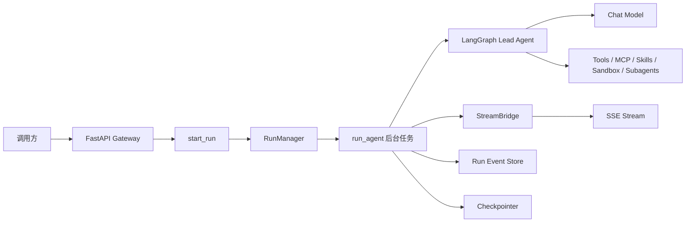
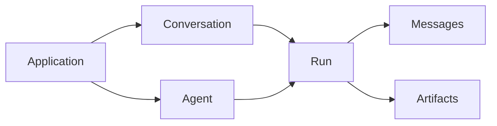
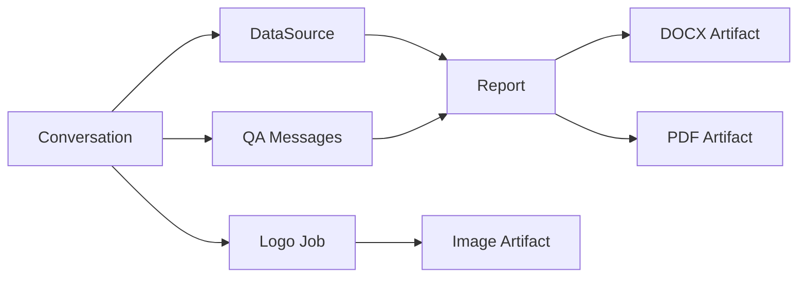
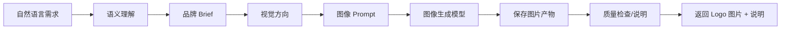
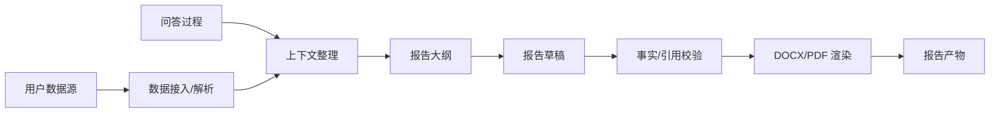

# intelli-engine 后端 AI 能力平台设计报告

> 版本：v0.1  
> 日期：2026-06-23  
> 范围：后端能力平台设计，不包含 intelli-engine 自带前端改造  
> 定位：面向外部应用/团队调用的 Agent Runtime Backend / AI Capability Service

## 1. 背景与目标

当前 `intelli-engine` 基于 DeerFlow/OntoAgent 架构，具备完整的智能体运行时、对话、工具、技能、MCP、沙箱、文件、记忆、产物等能力。但后续使用方式不再以 intelli-engine 自带前端为核心，而是由其它团队建设前端或业务应用，`intelli-engine` 只作为后端 AI 能力引擎对外提供服务。

本报告目标是将前期讨论收敛为一份可评审、可拆解、可落地的后端平台设计文档，明确：

- intelli-engine 的后端平台定位。
- 当前代码事实和可复用能力。
- 对外 `/api/v1` 接口设计。
- 对话、Agent、Run、Artifact、数据源、报告、AI Logo 等能力边界。
- 在线接口文档要求。
- 分阶段实施路线和验收标准。

## 2. 平台定位

`intelli-engine` 应定位为：

```text
Agent Runtime Backend / AI Capability Service
```

即：

```text
外部应用 / 前端团队 / 业务系统
  -> 调用 intelli-engine 后端 API
  -> 获得对话、Agent、文本、Logo、报告、文件、产物等 AI 能力
```

外部应用负责：

- 页面交互。
- 用户入口。
- 业务表单。
- 前端状态管理。
- 用户体验设计。
- 自身业务账号和权限体系。

`intelli-engine` 负责：

- 会话创建与维护。
- Agent 调用。
- 多轮上下文管理。
- 流式输出。
- 模型路由。
- 工具调用。
- 文件上传与上下文注入。
- 数据源解析和问答总结。
- Logo/图片设计生成。
- 报告生成和 PDF/DOCX 导出。
- 产物管理。
- Run 状态管理。
- Token 统计。
- 审计与调用追踪。

## 3. 当前代码事实

### 3.1 总体后端分层

当前后端主要分为两层。

#### App 应用层

路径：

```text
backend/app
```

主要职责：

- FastAPI Gateway。
- HTTP API。
- 鉴权和 CSRF。
- 线程、Run、模型、技能、MCP、上传、产物等路由。
- IM 渠道接入。

关键文件：

```text
backend/app/gateway/app.py
backend/app/gateway/deps.py
backend/app/gateway/services.py
backend/app/gateway/routers/thread_runs.py
backend/app/gateway/routers/runs.py
backend/app/gateway/routers/threads.py
backend/app/gateway/routers/agents.py
backend/app/gateway/routers/artifacts.py
backend/app/gateway/routers/uploads.py
```

#### Harness 智能体框架层

路径：

```text
backend/packages/harness/deerflow
```

主要职责：

- LangGraph Agent Runtime。
- Lead Agent。
- Middleware 链。
- Tools。
- Skills。
- MCP。
- Sandbox。
- Models。
- Memory。
- Persistence。
- RunManager。
- StreamBridge。

关键文件：

```text
backend/packages/harness/deerflow/agents/lead_agent/agent.py
backend/packages/harness/deerflow/tools/tools.py
backend/packages/harness/deerflow/runtime/runs/worker.py
backend/packages/harness/deerflow/models/factory.py
backend/packages/harness/deerflow/sandbox
backend/packages/harness/deerflow/skills
backend/packages/harness/deerflow/mcp
backend/packages/harness/deerflow/persistence
```

### 3.2 Harness / App 依赖方向

当前后端有明确边界：

```text
app -> deerflow    允许
deerflow -> app    禁止
```

该边界由测试约束：

```text
backend/tests/test_harness_boundary.py
```

因此后续 `/api/v1` 外部适配层应放在 `app.gateway` 下，不应下沉到 `deerflow` 包中。`deerflow` 继续作为智能体内核，`app.gateway.v1` 作为对外服务包装层。

### 3.3 当前运行链路

当前对话/Agent 执行链路如下：



关键事实：

- LangGraph 入口在 `backend/langgraph.json`。
- 图注册为 `deerflow.agents:make_lead_agent`。
- Gateway 通过 `start_run()` 创建后台 Run。
- `run_agent()` 执行 LangGraph agent。
- `StreamBridge` 负责流式事件。
- `RunEventStore` 记录消息、事件和 token。
- `Checkpointer` 维护多轮上下文。

### 3.4 已有可复用能力

当前已有能力可以直接复用：

- 有状态会话：`/api/threads`。
- Run 生命周期：`/api/threads/{thread_id}/runs`。
- 无状态 Run：`/api/runs`。
- 流式输出：`StreamingResponse + StreamBridge`。
- 自定义 Agent：`/api/agents`，底层为 `config.yaml + SOUL.md`。
- 文件上传：`/api/threads/{thread_id}/uploads`。
- Artifact 访问：`/api/threads/{thread_id}/artifacts/{path}`。
- 模型管理：`/api/models`。
- MCP 管理：`/api/mcp`。
- Skills 管理：`/api/skills`。
- Memory 管理：`/api/memory`。
- Token usage：Run 记录和 thread token 统计。

## 4. 设计原则

### 4.1 不重写 Runtime

第一阶段不重写 DeerFlow/LangGraph runtime，继续复用：

```text
RunManager
StreamBridge
make_lead_agent
ThreadMetaStore
Checkpointer
RunEventStore
Tools
Skills
Custom Agent
```

### 4.2 新增外部适配层

新增：

```text
/api/v1/*
```

作为面向其它应用和团队的稳定 API 契约。

保留现有：

```text
/api/*
```

作为内部接口、兼容接口和高级调试接口。

### 4.3 隐藏内部概念

外部团队只应理解：

```text
conversation_id
agent_id
run_id
artifact_id
datasource_id
report_id
job_id
```

不应直接依赖：

```text
thread_id
RunnableConfig
configurable
checkpoint
stream_mode
LangGraph values/messages/custom
sandbox virtual path
/mnt/user-data/outputs
SOUL.md
```

### 4.4 API 优先服务端集成

第一阶段建议外部调用链路为：

```text
外部前端 -> 外部团队 BFF/后端 -> intelli-engine
```

不建议浏览器直接持有 `X-API-Key` 调用 intelli-engine。

## 5. 推荐新增模块结构

建议新增以下目录：

```text
backend/app/gateway/routers/v1/
  __init__.py
  conversations.py
  agents.py
  runs.py
  capabilities.py
  data_sources.py
  reports.py
  artifacts.py
  ai_logo.py

backend/app/gateway/schemas/v1/
  __init__.py
  common.py
  conversations.py
  agents.py
  runs.py
  capabilities.py
  data_sources.py
  reports.py
  artifacts.py
  ai_logo.py

backend/app/gateway/services/v1/
  __init__.py
  external_context.py
  run_adapter.py
  sse_mapper.py
  conversation_service.py
  agent_service.py
  run_service.py
  artifact_service.py
  data_source_service.py
  report_service.py
  logo_service.py
```

职责：

```text
routers/v1    HTTP 入参/出参
schemas/v1    对外 DTO
services/v1   外部 API 到现有 DeerFlow 能力的适配
deerflow.*     继续作为 Agent Runtime 内核
```

## 6. 外部统一鉴权与调用上下文

### 6.1 请求头

所有外部调用建议统一携带：

```http
X-App-Id: design-platform
X-API-Key: ********
X-Request-Id: req_001
X-User-Id: external_user_123
```

字段说明：

| Header | 说明 |
|---|---|
| `X-App-Id` | 调用方应用 ID |
| `X-API-Key` | 服务端到服务端鉴权凭证 |
| `X-Request-Id` | 调用链路追踪 ID |
| `X-User-Id` | 外部系统的终端用户 ID |

### 6.2 External Context

内部建议抽象：

```text
ExternalContext
  app_id
  external_user_id
  request_id
  tenant_id 可选
```

该上下文应写入：

- thread metadata。
- run metadata。
- `config.context.user_id`。
- 日志。
- 错误响应。
- run events。

### 6.3 数据隔离维度

建议平台治理以以下维度展开：

```text
app_id
external_user_id
conversation_id
agent_id
run_id
artifact_id
datasource_id
report_id
```

## 7. 核心资源模型

### 7.1 第一阶段核心资源

```text
Application
Agent
Conversation
Run
Artifact
```

关系：



### 7.2 增强阶段新增资源

```text
DataSource
Report
LogoJob
```

关系：



### 7.3 内部映射

| 外部概念 | 内部概念 |
|---|---|
| `conversation_id` | `thread_id` |
| `agent_id` | `assistant_id` / `agent_name` |
| `run_id` | `RunRecord.run_id` |
| `artifact_id` | `thread_id + virtual_path` 映射 |
| `datasource_id` | 上传文件 / 文本 / URL / 外部数据源记录 |
| `report_id` | 报告生成任务 ID |
| `job_id` | 图片生成异步任务 ID |

## 8. `/api/v1` 总体接口规划

### 8.1 第一阶段 MVP 接口

```http
POST /api/v1/conversations
POST /api/v1/conversations/{conversation_id}/messages
POST /api/v1/conversations/{conversation_id}/stream
GET  /api/v1/conversations/{conversation_id}/messages

GET  /api/v1/agents
POST /api/v1/agents/{agent_id}/invoke
POST /api/v1/agents/{agent_id}/stream

GET  /api/v1/runs/{run_id}
POST /api/v1/runs/{run_id}/cancel

GET  /api/v1/capabilities
```

### 8.2 第二阶段增强接口

```http
POST /api/v1/conversations/{conversation_id}/data-sources
GET  /api/v1/conversations/{conversation_id}/data-sources

POST /api/v1/conversations/{conversation_id}/reports
GET  /api/v1/reports/{report_id}

GET  /api/v1/artifacts/{artifact_id}
GET  /api/v1/conversations/{conversation_id}/artifacts
```

### 8.3 AI Logo 图片生成接口

```http
POST /api/v1/ai/logo/generate
GET  /api/v1/ai/logo/jobs/{job_id}
POST /api/v1/ai/logo/variants
POST /api/v1/ai/logo/review
```

## 9. Conversation API 设计

### 9.1 创建会话

```http
POST /api/v1/conversations
```

请求：

```json
{
  "agent_id": "lead-agent",
  "title": "咖啡品牌设计",
  "metadata": {
    "project_id": "p_001",
    "scene": "logo_design"
  }
}
```

响应：

```json
{
  "conversation_id": "conv_001",
  "agent_id": "lead-agent",
  "status": "idle",
  "title": "咖啡品牌设计",
  "created_at": "2026-06-23T10:00:00Z",
  "updated_at": "2026-06-23T10:00:00Z",
  "metadata": {
    "project_id": "p_001",
    "scene": "logo_design"
  }
}
```

内部映射：

```text
conversation_id = thread_id
ThreadMetaStore.create()
checkpointer.aput(empty_checkpoint())
```

### 9.2 发送非流式消息

```http
POST /api/v1/conversations/{conversation_id}/messages
```

请求：

```json
{
  "agent_id": "brand-agent",
  "content": "帮我设计一个面向年轻白领的精品咖啡品牌定位",
  "options": {
    "model": "default",
    "thinking_enabled": true,
    "subagent_enabled": false
  },
  "metadata": {
    "biz_scene": "brand_strategy"
  }
}
```

响应：

```json
{
  "run_id": "run_001",
  "conversation_id": "conv_001",
  "agent_id": "brand-agent",
  "status": "success",
  "message": {
    "role": "assistant",
    "content": "..."
  },
  "artifacts": [],
  "usage": {
    "input_tokens": 100,
    "output_tokens": 500,
    "total_tokens": 600
  }
}
```

内部映射：

```text
POST /api/v1/conversations/{id}/messages
  -> RunCreateRequest
  -> start_run()
  -> wait_for_run_completion()
  -> run_event_store.list_messages_by_run()
  -> 提取最后一条 assistant message
```

### 9.3 发送流式消息

```http
POST /api/v1/conversations/{conversation_id}/stream
```

外部 SSE 事件第一阶段只暴露：

```text
run.started
message.delta
run.completed
run.failed
```

示例：

```text
event: run.started
data: {"run_id":"run_001","conversation_id":"conv_001","agent_id":"brand-agent"}

event: message.delta
data: {"run_id":"run_001","delta":"你好"}

event: run.completed
data: {"run_id":"run_001","status":"success"}
```

内部映射：

```text
start_run()
StreamBridge.subscribe()
内部 metadata/messages/error/end -> 外部标准 SSE 事件
```

## 10. Agent API 设计

### 10.1 Agent 清单

```http
GET /api/v1/agents
```

第一阶段只读，不开放外部创建/修改 Agent。

推荐预置：

```text
lead-agent
brand-agent
copywriting-agent
logo-agent
report-agent
```

响应：

```json
{
  "agents": [
    {
      "agent_id": "lead-agent",
      "name": "通用智能体",
      "type": "system",
      "description": "通用任务和对话",
      "enabled": true
    },
    {
      "agent_id": "brand-agent",
      "name": "品牌智能体",
      "type": "custom",
      "description": "品牌定位、命名、slogan、Logo brief",
      "enabled": true
    },
    {
      "agent_id": "report-agent",
      "name": "报告智能体",
      "type": "custom",
      "description": "基于数据源和问答过程生成 PDF/DOCX 报告",
      "enabled": true
    }
  ]
}
```

### 10.2 一次性调用 Agent

```http
POST /api/v1/agents/{agent_id}/invoke
```

适用：

- 单轮文案生成。
- 摘要。
- 分类。
- Logo brief。
- 报告大纲生成。

内部流程：

```text
生成临时 conversation/thread
assistant_id = agent_id
start_run()
wait_for_run_completion()
返回最终 assistant message
```

### 10.3 流式调用 Agent

```http
POST /api/v1/agents/{agent_id}/stream
```

内部流程：

```text
生成临时 conversation/thread
assistant_id = agent_id
start_run()
StreamBridge.subscribe()
SSE normalize
```

## 11. Run API 设计

### 11.1 查询 Run

```http
GET /api/v1/runs/{run_id}
```

响应：

```json
{
  "run_id": "run_001",
  "conversation_id": "conv_001",
  "agent_id": "brand-agent",
  "status": "success",
  "created_at": "...",
  "updated_at": "...",
  "usage": {
    "input_tokens": 100,
    "output_tokens": 500,
    "total_tokens": 600
  },
  "error": null
}
```

### 11.2 取消 Run

```http
POST /api/v1/runs/{run_id}/cancel
```

请求：

```json
{
  "action": "interrupt",
  "wait": false
}
```

内部映射：

```text
RunManager.cancel(run_id, action)
```

## 12. Artifact API 设计

### 12.1 设计目标

现有 artifact 使用 thread virtual path，例如：

```text
/mnt/user-data/outputs/xxx
```

该路径不适合外部团队直接依赖。因此 `/api/v1` 应提供 `artifact_id`。

### 12.2 推荐接口

```http
GET /api/v1/artifacts/{artifact_id}
GET /api/v1/conversations/{conversation_id}/artifacts
```

Artifact DTO：

```json
{
  "artifact_id": "art_001",
  "conversation_id": "conv_001",
  "run_id": "run_001",
  "filename": "report.pdf",
  "mime_type": "application/pdf",
  "url": "/api/v1/artifacts/art_001",
  "created_at": "2026-06-23T10:00:00Z"
}
```

### 12.3 实现阶段

第一阶段可暂缓完整 Artifact Registry。

第二阶段建议新增轻量映射：

```text
artifact_id
thread_id
run_id
virtual_path
filename
mime_type
created_at
metadata
```

## 13. Capabilities API

```http
GET /api/v1/capabilities
```

响应：

```json
{
  "conversation": {
    "streaming": true,
    "multi_turn": true,
    "file_upload": true
  },
  "agents": {
    "custom_agents": true,
    "subagents": true
  },
  "reports": {
    "datasource_summary": true,
    "docx": true,
    "pdf": true
  },
  "logo": {
    "semantic_design": true,
    "image_generate": true
  }
}
```

## 14. 在线接口文档设计

### 14.1 文档方式

当前后端已经使用 FastAPI，因此推荐使用 FastAPI 原生 OpenAPI + Swagger UI。

对外提供：

```text
/docs
/redoc
/openapi.json
```

如果需要外部 API 专属文档，可扩展：

```text
/api/v1/docs
/api/v1/openapi.json
```

第一阶段推荐先使用 FastAPI 全局 `/docs`，通过 tags 分组。

### 14.2 OpenAPI Tags

建议 tags：

```text
v1-conversations
v1-agents
v1-runs
v1-capabilities
v1-artifacts
v1-data-sources
v1-reports
v1-ai-logo
```

### 14.3 接口文档要求

每个接口必须包含：

- `summary`。
- `description`。
- `response_model`。
- `status_code`。
- 请求示例。
- 响应示例。
- 错误响应说明。

错误模型需进入 OpenAPI：

```text
400 INVALID_ARGUMENT
401 UNAUTHORIZED
403 FORBIDDEN
404 RESOURCE_NOT_FOUND
409 RUN_CONFLICT
500 INTERNAL_ERROR
503 SERVICE_UNAVAILABLE
```

### 14.4 Markdown 文档

除 Swagger 外，建议新增：

```text
docs/API_V1_EXTERNAL_PLATFORM.md
```

用于给业务团队和前端团队阅读，内容包括：

- 平台定位。
- 鉴权。
- API 列表。
- SSE 协议。
- 错误码。
- 外部调用示例。
- 内部映射关系。

## 15. AI Logo 图片生成能力设计

### 15.1 能力定义

`ai-logo` 不是简单 prompt 生成，而是：

```text
基于用户自然语言语义理解，进行品牌/视觉设计分析，并最终生成 Logo 或图片。
```

完整链路：



### 15.2 推荐接口

```http
POST /api/v1/ai/logo/generate
GET  /api/v1/ai/logo/jobs/{job_id}
```

生成请求：

```json
{
  "input": "我想做一个面向年轻白领的精品咖啡品牌 logo，名字叫 Mellow Cup，希望简洁、有温度、不要太复杂",
  "options": {
    "style": "minimal",
    "count": 4,
    "size": "1024x1024",
    "transparent_background": true,
    "language": "zh-CN"
  },
  "metadata": {
    "project_id": "p_001"
  }
}
```

响应建议异步：

```json
{
  "job_id": "job_logo_001",
  "run_id": "run_001",
  "status": "queued",
  "conversation_id": "conv_001"
}
```

查询结果：

```json
{
  "job_id": "job_logo_001",
  "status": "success",
  "design": {
    "brand_understanding": "...",
    "visual_direction": "...",
    "prompt": "...",
    "negative_prompt": "..."
  },
  "assets": [
    {
      "artifact_id": "art_001",
      "url": "/api/v1/artifacts/art_001",
      "mime_type": "image/png",
      "width": 1024,
      "height": 1024
    }
  ]
}
```

### 15.3 内部组件

建议新增：

```text
logo-agent
logo_generate tool/service
logo job store
artifact service
```

`logo-agent` 职责：

- 理解用户语义。
- 提取品牌名称、行业、受众、关键词、禁忌。
- 生成视觉方向。
- 生成图像 prompt。
- 调用图像生成工具。
- 解释设计结果。

`logo_generate` 职责：

- 调用图片生成模型。
- 保存图片文件。
- 注册 artifact。
- 返回图片资源。

### 15.4 为什么异步

Logo 图片生成通常：

- 耗时长。
- 可能失败。
- 需要重试。
- 一次生成多张。
- 需要保存文件。
- 后续可能增加变体、高清化、透明背景、审核。

因此不建议同步阻塞 HTTP 请求。

## 16. 数据源与报告生成能力设计

### 16.1 新需求定义

新增能力：

```text
根据用户输入的数据源及问答过程，最终总结生成报告，并导出 PDF/DOCX。
```

这不是简单聊天记录导出，而是：

```text
用户提供数据源
用户围绕数据源进行问答/分析
系统记录上下文、证据、结论
最终生成正式报告
导出 PDF 和 DOCX
返回 artifact 下载地址
```

### 16.2 完整链路



### 16.3 数据源类型

第一期建议支持：

| 类型 | 说明 |
|---|---|
| 文件上传 | PDF / DOCX / XLSX / CSV / TXT / Markdown |
| 文本输入 | 用户直接粘贴文本 |
| URL | 网页内容抓取，可复用 web_fetch |
| 对话上下文 | conversation messages / run events |
| 结构化数据 | JSON 表单、业务对象 |

第二期再考虑：

- 数据库。
- 企业知识库。
- 对象存储。
- 第三方 API。
- 企业文档系统。

### 16.4 DataSource API

登记文本数据源：

```http
POST /api/v1/conversations/{conversation_id}/data-sources
```

请求：

```json
{
  "type": "text",
  "name": "项目背景资料",
  "content": "这里是用户输入的数据源内容...",
  "metadata": {
    "source_type": "manual",
    "biz_id": "p_001"
  }
}
```

响应：

```json
{
  "datasource_id": "ds_001",
  "conversation_id": "conv_001",
  "type": "text",
  "name": "项目背景资料",
  "status": "ready"
}
```

查询数据源：

```http
GET /api/v1/conversations/{conversation_id}/data-sources
```

文件型数据源可以复用现有上传能力：

```http
POST /api/v1/conversations/{conversation_id}/files
```

内部映射：

```text
/api/threads/{thread_id}/uploads
UploadsMiddleware
thread user-data/uploads
```

### 16.5 Report API

基于会话、数据源、问答过程生成报告：

```http
POST /api/v1/conversations/{conversation_id}/reports
```

请求：

```json
{
  "title": "项目分析报告",
  "format": ["pdf", "docx"],
  "report_type": "analysis",
  "datasource_ids": ["ds_001", "ds_002"],
  "include_conversation": true,
  "include_citations": true,
  "language": "zh-CN",
  "style": "business",
  "sections": [
    "执行摘要",
    "背景与数据来源",
    "关键发现",
    "问答洞察总结",
    "风险与建议",
    "附录"
  ]
}
```

响应建议异步：

```json
{
  "report_id": "rep_001",
  "run_id": "run_001",
  "conversation_id": "conv_001",
  "status": "queued"
}
```

查询报告：

```http
GET /api/v1/reports/{report_id}
```

成功响应：

```json
{
  "report_id": "rep_001",
  "status": "success",
  "title": "项目分析报告",
  "artifacts": [
    {
      "artifact_id": "art_docx_001",
      "format": "docx",
      "filename": "project-analysis-report.docx",
      "url": "/api/v1/artifacts/art_docx_001"
    },
    {
      "artifact_id": "art_pdf_001",
      "format": "pdf",
      "filename": "project-analysis-report.pdf",
      "url": "/api/v1/artifacts/art_pdf_001"
    }
  ],
  "summary": "报告已基于 2 个数据源和 14 轮问答生成。"
}
```

### 16.6 report-agent

建议新增：

```text
report-agent
```

职责：

- 理解数据源。
- 整理问答过程。
- 抽取事实、结论、证据。
- 生成报告大纲。
- 生成章节内容。
- 标注引用来源。
- 输出结构化 `ReportSpec`。

### 16.7 ReportSpec 中间格式

不要让 Agent 直接随意生成 DOCX/PDF。建议先生成结构化中间格式：

```json
{
  "title": "项目分析报告",
  "subtitle": "基于用户数据源与问答过程生成",
  "metadata": {
    "author": "intelli-engine",
    "language": "zh-CN"
  },
  "sections": [
    {
      "heading": "执行摘要",
      "content": [
        {
          "type": "paragraph",
          "text": "..."
        },
        {
          "type": "bullets",
          "items": ["...", "..."]
        }
      ]
    },
    {
      "heading": "关键发现",
      "content": [
        {
          "type": "table",
          "columns": ["发现", "证据", "建议"],
          "rows": [["...", "...", "..."]]
        }
      ]
    }
  ],
  "citations": [
    {
      "id": "src_001",
      "label": "项目背景资料",
      "source_type": "datasource",
      "locator": "第 2 段"
    }
  ]
}
```

优点：

- 报告内容和渲染解耦。
- 同源生成 DOCX/PDF。
- 便于测试。
- 便于模板化。
- 便于引用校验。
- 便于后续支持更多格式。

### 16.8 文档生成策略

DOCX：

```text
ReportSpec -> DOCX renderer -> .docx artifact
```

PDF：

推荐优先：

```text
DOCX -> PDF
```

备选：

```text
ReportSpec -> reportlab -> PDF
```

推荐原因：

- DOCX 适合企业报告继续编辑。
- PDF 适合最终交付。
- 同源转换可减少内容不一致。

### 16.9 报告产物保存

建议保存到当前 conversation/thread outputs：

```text
/mnt/user-data/outputs/reports/{report_id}.docx
/mnt/user-data/outputs/reports/{report_id}.pdf
```

对外只返回：

```text
artifact_id
url
filename
mime_type
```

### 16.10 报告类型

第一期建议支持：

| report_type | 说明 |
|---|---|
| `analysis` | 分析报告 |
| `summary` | 问答总结报告 |
| `research` | 研究报告 |
| `meeting_notes` | 会议/访谈纪要 |
| `decision_memo` | 决策备忘录 |

默认章节示例：

```text
analysis:
- 执行摘要
- 背景与数据来源
- 核心问题
- 关键发现
- 问答洞察
- 风险与限制
- 建议与下一步
- 附录

summary:
- 概览
- 主要问题
- 关键回答
- 结论
- 待办事项
```

## 17. 错误码规范

统一错误结构：

```json
{
  "success": false,
  "error": {
    "code": "AGENT_NOT_FOUND",
    "message": "Agent not found",
    "details": {}
  },
  "request_id": "req_001"
}
```

建议第一期错误码：

```text
UNAUTHORIZED
FORBIDDEN
INVALID_ARGUMENT
APP_NOT_ALLOWED
CONVERSATION_NOT_FOUND
AGENT_NOT_FOUND
MODEL_NOT_AVAILABLE
RUN_CONFLICT
RUN_NOT_FOUND
RUN_CANCELLED
RUN_FAILED
ARTIFACT_NOT_FOUND
DATASOURCE_NOT_FOUND
REPORT_NOT_FOUND
FILE_TOO_LARGE
RATE_LIMITED
MODEL_TIMEOUT
MODEL_PROVIDER_ERROR
TOOL_EXECUTION_ERROR
INTERNAL_ERROR
SERVICE_UNAVAILABLE
```

## 18. 分阶段实施路线

### 18.1 第一阶段：Agent Backend Adapter

目标：

```text
将现有 intelli-engine 包装成其它团队可调用的 Agent 后端服务。
```

范围：

```text
POST /api/v1/conversations
POST /api/v1/conversations/{id}/messages
POST /api/v1/conversations/{id}/stream
GET  /api/v1/conversations/{id}/messages

GET  /api/v1/agents
POST /api/v1/agents/{id}/invoke
POST /api/v1/agents/{id}/stream

GET  /api/v1/runs/{id}
POST /api/v1/runs/{id}/cancel
GET  /api/v1/capabilities

Swagger / OpenAPI 文档
```

不包含：

- Logo 图片生成。
- 报告生成。
- Artifact Registry 完整实现。
- 外部 Agent 创建/修改。
- WebSocket。
- 复杂多租户计费。

### 18.2 第二阶段：DataSource + Report Generation

目标：

```text
基于数据源和问答过程生成正式报告，并导出 PDF/DOCX。
```

范围：

```text
DataSource API
Report API
ReportSpec
report-agent
DOCX/PDF renderer
Artifact 简化注册
```

### 18.3 第三阶段：AI Logo 图片生成

目标：

```text
基于自然语言语义理解生成 Logo/图片。
```

范围：

```text
logo-agent
logo_generate tool/service
图像模型接入
异步 job
图片 artifact
Logo review / variants
```

### 18.4 第四阶段：平台治理

目标：

```text
企业级集成、稳定性和治理能力。
```

范围：

- API Key 管理。
- 应用限流。
- Token 配额。
- 审计日志。
- 调用统计。
- OpenAPI SDK。
- 更细权限控制。
- Artifact Registry 持久化。
- Report 模板管理。
- Logo 供应商切换。

## 19. 第一阶段验收标准

第一阶段完成后，其它团队应能完成：

```text
1. 通过 API Key 调用 intelli-engine。
2. 查询可用 Agent。
3. 创建 conversation。
4. 发送非流式消息并获得完整回复。
5. 发送流式消息并接收 message.delta。
6. 查询 conversation 历史消息。
7. 查询 run 状态。
8. 取消 running run。
9. 打开 Swagger 文档查看 /api/v1 接口。
10. 导出 /openapi.json 并导入 Apifox/Postman。
```

不要求外部团队理解：

```text
LangGraph
thread_id
RunnableConfig
checkpoint
stream_mode
sandbox path
SOUL.md
```

## 20. 测试建议

建议新增测试：

```text
backend/tests/test_v1_external_context.py
backend/tests/test_v1_run_adapter.py
backend/tests/test_v1_conversations.py
backend/tests/test_v1_agents.py
backend/tests/test_v1_runs.py
backend/tests/test_v1_sse_mapper.py
backend/tests/test_v1_capabilities.py
backend/tests/test_v1_reports.py
backend/tests/test_v1_ai_logo.py
```

重点验证：

- `conversation_id` 是否正确映射 `thread_id`。
- `agent_id` 是否正确映射 `assistant_id/agent_name`。
- `RunCreateRequest` 是否构造正确。
- SSE 是否隐藏 LangGraph 内部事件。
- 非流式是否能提取最终 assistant message。
- 错误码是否统一。
- `X-App-Id/X-User-Id` 是否进入 metadata/context。
- Swagger 是否包含 `/api/v1` 接口。
- ReportSpec 是否稳定生成。
- DOCX/PDF artifact 是否能被访问。
- Logo 图片生成 job 是否可查询。

## 21. 推荐结论

`intelli-engine` 后续应优先演进为：

```text
可被其它系统稳定集成的后端 AI 能力平台
```

第一阶段不追求所有 AI 能力一次性完成，而应先交付：

```text
/api/v1 Agent Backend Adapter
```

在此基础上逐步扩展：

```text
DataSource + Report Generation
AI Logo semantic image generation
Artifact Registry
平台治理
```

其中，报告生成能力应作为企业级场景的重点增强能力：

```text
DataSource + Conversation QA -> report-agent -> ReportSpec -> DOCX/PDF -> Artifact
```

AI Logo 能力应作为设计生成能力：

```text
Natural Language -> logo-agent -> Visual Brief -> Image Prompt -> Image Model -> Logo Artifact
```

通过这种设计，`intelli-engine` 不再只是聊天后端，而是能够向多个业务系统提供统一、可文档化、可治理、可扩展的智能体能力和 AI 产物生成能力。
